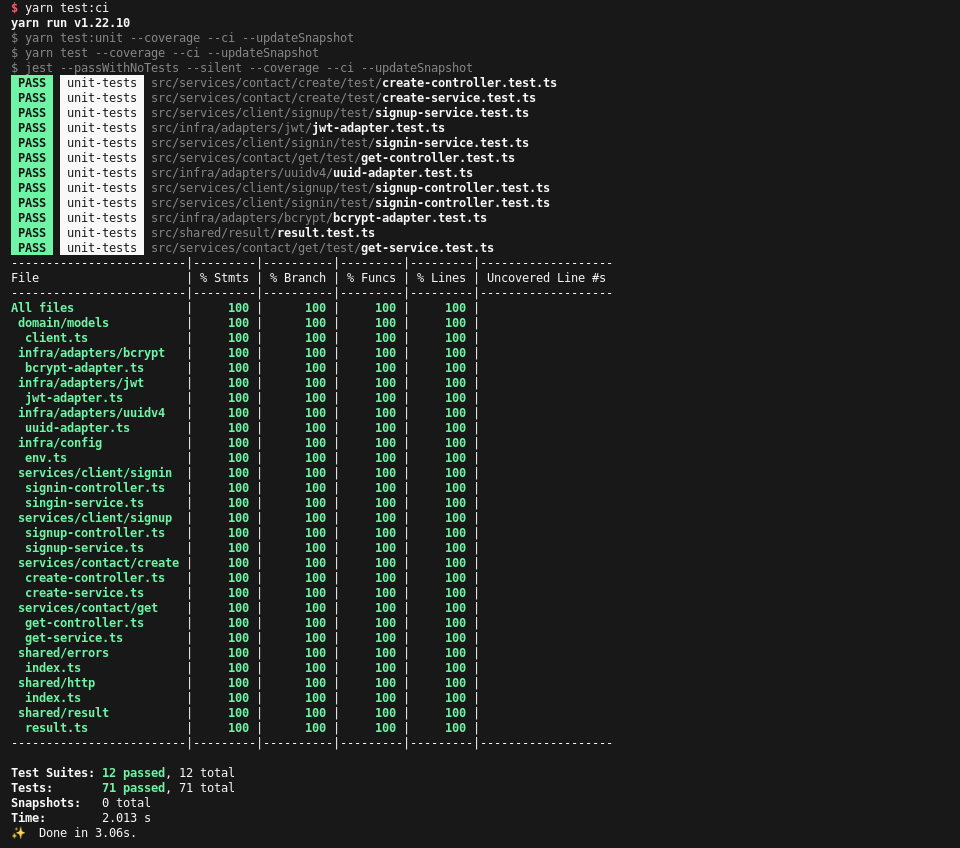

<div align="center">

# Back-end API

## Mercafacil Test

</div>

---

# badges


# Status do Projeto

Finalizando...

# Tabela de conteúdos

1. [Funcionalidades](#funcionalidades)
1. [Pré-requisitos](#prerequisitos)
1. [Iniciando o projeto](#iniciando)
   - [Docker compose](#dockercompose)
   - [Makefile](#makefile)
   - [Arquivo `.env`](#env)
1. [Como testar localmente](#comotestar)
   - [API](#api)
1. [Arquitetura do sistema](#arquitetura)
1. [Testes](#testes)
   - [Testes unitários](#unitarios)
1. [CI - GitHub Actions](#githubactions)
1. [Scripts](#scripts)
1. [Tecnologias usadas](#tecnologias)
1. [Autor](#autor)

<div id="funcionalidades"></div>

## Funcionalidades

Este projeto consiste em uma API para cadastro de clientes dos tipos `macapá` e `varejâo` e estes podem cadastrar contatos de telefone em bases de dados diferentes usando o mesmo _endpoint_.

Clientes não cadastrados:

- [x] Se cadastrar informando nome, email, senha e tipo (varejão ou macapá).
- [x] Realizar o login na aplicação informando email, senha e tipo.

Clientes cadastrados:

- [x] Salvar seus contatos informando nome e telefone.
- [x] Recuperar seus contatos.

Todos os clientes podem realizar chamadas HTTP para os mesmos endpoints da aplicação, a diferença está definida em um campo no token JWT que será descriptografado, validado e com base nos valores retornados, será executada determinada operação de acordo com o tipo do cliente.

<div id="prerequisitos"></div>

## Pré-requisitos

Para iniciar os testes localmente com este projeto, você deve ter instalado em sua máquina o [Node.js](https://nodejs.org/en/), [Yarn](https://yarnpkg.com/), [Docker](https://www.docker.com/) e [Git](https://git-scm.com/).

<div id="iniciando"></div>

## Iniciando o projeto

Para começar, faça o clone deste repositório:

```bash
$ git clone https://github.com/IglanCardeal/mercafacil-test.git
```

e acesse a pasta do projeto:

```bash
$ cd mercafacil-test
```

Instale as dependências usando o Yarn:

```bash
$ yarn install
```

<sup>Caso você não tenha o yarn instalado, instale-o usando o npm: `$ npm install -g yarn`</sup>

Renomeie o arquivo `.env.example` para `.env`. Para saber mais sobre este arquivo, [clique aqui](#env).

<div id="dockercompose"></div>

### Docker compose

Este projeto possui o arquivo `docker-compose.yml` que deve ser usado para iniciar os servidores de banco de dados MySQL e Postgres. O arquivo tem a seguinte estrutura:

```yml
version: '3'

services:
  mysql:
    container_name: mercafacil-api-mysql
    image: mysql
    restart: always
    environment:
      - MYSQL_ROOT_PASSWORD=admin
      - MYSQL_DATABASE=admin
      - MYSQL_USER=admin
      - MYSQL_PASSWORD=admin
      - MYSQL_ROOT_HOST=%
    ports:
      - '3306:3306'
    command: --default-authentication-plugin=mysql_native_password
    volumes:
      - ./docker-volumes/mercafacil-api/mysql:/data/dbc

  postgresql:
    container_name: mercafacil-api-postgres
    image: postgres
    restart: always
    ports:
      - '5432:5432'
    environment:
      POSTGRES_PASSWORD: 'admin'
      POSTGRES_USER: 'admin'
    volumes:
      - ./docker-volumes/mercafacil-api/postgres:/data/dbc
```

Faça os devidos ajustes de acordo com seu ambiente. Os `volumes` dos containers ficarão dentro da pasta `docker-volumes` na raiz do projeto.

<div id="makefile"></div>

### Makefile

Este é um arquivo [Make](<https://en.wikipedia.org/wiki/Make_(software)>) usado para simplificar os comandos do `docker-compose`, ou seja, ao invés de ter que executar o comando `docker-compose logs -f` para obter os logs, com Makefile basta executar `make logs`. O arquivo tem a seguinte estrutura:

```yml
.PHONY: up

.PHONY: logs

.PHONY: down

up:
	docker-compose up -d

down:
	docker-compose down

logs:
	docker-compose logs -f
```

Execute o comando `make up` para executar o `docker-compose` e iniciar/instalar os bancos de dados.

Por fim, execute o comando:

```bash
$ yarn dev
```

Isto irá subir o servidor em modo `development`, mas pronto para receber as chamadas HTTP. Por padrão, o servidor escuta na URL ` http://127.0.0.1:3000` (`3000` porta definida no `.env`).

<div id="env"></div>

### Arquivo `.env`

O projeto usa um arquivo do tipo `.env` é utilizado pela aplicação para usar as [variáveis de ambiente](https://en.wikipedia.org/wiki/Environment_variable). Neste arquivo é definido as credenciais que será utilizada pela aplicação. Na raiz do projeto, eu coloquei um arquivo `.env.example` para que você possa se basear para configurar sua credenciais.

Os valores informados e sua motivação são explicadas a seguir:

- `PORT` -> que defini a porta a ser usada pelo servidor.
- `PRIVATE_KEY` -> chave RSA privada que será usada pela classe `JsonWebTokenAdapter` para assinar o token de autenticação.
- `PUBLIC_KEY` -> chave RSA publica usado para verificar o token de autenticação.

No mesmo, também, devem ser informadas as credenciais para acesso a banco de dados que serão acessados pela aplicação:

1. credenciais para conexão com banco MySQL:

   ```none
   MYSQL_ROOT_PASSWORD=
   MYSQL_DATABASE=
   MYSQL_USER=
   MYSQL_PASSWORD=
   MYSQL_PORT=3306 # porta padrão
   MYSQL_ROOT_HOST= 127.0.0.1 # host padrão
   ```

2. credenciais para conexão com banco Postgres:

   ```none
   POSTGRES_DATABASE=
   POSTGRES_PASSWORD=
   POSTGRES_USER=
   POSTGRES_PORT= 5432 # porta padrão
   POSTGRES_ROOT_HOST= 127.0.0.1 # host padrão
   ```

Recomendo que você use as credenciais que já estão no arquivo de exemplo, mas caso queira alterá-las, não esqueça de fazer os ajustes no arquivo do [`docker-compose.yml`](#dockercompose).

<div id="comotestar"></div>

## Como testar localmente

<div id="api"></div>

### API

<div id="arquitetura"></div>

## Arquitetura do sistema

<div id="testes"></div>

## Testes

<div id="unitarios"></div>

### Testes unitários

As configuraçôes de testes unitários estão no arquivo `jest.config.js` e durante a execuçâo destes testes, será exibido o prefixo `unit-tests`, destacando que tipo de teste está sendo executado.

A minha iniciativa de criar um sistema com módulos desacoplados (`controllers`,`services`, `repositories` e `adapters`) perimitiu a criaçâo de testes unitários dos principais módulos da aplicaçâo. Eu segui o TDD durante a criação dos principais módulos do sistemas. Cada um desses módulos possuem o seu respectivo teste unitário no próprio arquivo de produçâo ou dentro da pasta `test` no mesmo diretório. Exemplo:

```none
  |
  |-- services
      |
      |--first-service
      |     first-service.test.ts # arquivo de teste
      |     first-service.ts      # arquivo de produçâo
      |
      |--second-service
      |     second-service.test.ts # arquivo de teste
      |     second-service.ts      # arquivo de produçâo
```

Ou:

```none
  |
  |-- services
      |
      |--first-service
      |     test
      |       first-service.test.ts # arquivo de teste
      |     first-service.ts        # arquivo de produçâo
      |
      |--second-service
      |     test
      |       second-service.test.ts # arquivo de teste
      |     second-service.ts        # arquivo de produçâo
```

Caso queira saber os scripts de teste unitário, consulte a secão [Scripts](#scripts). um script exemplo de destaque é o `test:coverage` (execute `yarn test:coverage`) que irá executar os testes e ainda mostrar no terminal a cobertura de testes unitários da aplicação. Será mostrado algo como:



<div id="scripts"></div>

## Scripts

Dentro do arquivo `package.json`, temos os scripts que podem ser executados no projeto. Os principais serão destacados a seguir com o comando de execução, utilizando o gerenciador `yarn`:

- `dev` -> `yarn dev` - inicia o servidor do projeto em modo de desenvolvimento.
- `lint` -> `yarn lint` - usa as regras do arquivo `.eslintrc` para análise de estilo do código.
- `test:unit` -> `yarn test:unit` - (Alias: `test:u`) executa os testes unitários.
- `test:unit:watch` -> `yarn test:unit:watch` - (Alias: `test:u:w`) executa os testes unitários em modo `--watch`, ou seja, cada alteração em arquivo de teste/produção irá executar os testes novamentes automaticamentes.
- `test:verbose` -> `yarn test:verbose` - (Alias: `test:v`) executa os testes unitários em modo `--verbose`, ou seja, irá exibir todas as informações dos testes executados.

<div id="githubactions"></div>

## CI GitHub Actions

Este projeto faz o uso do [GitHub Actions](https://docs.github.com/pt/get-started) para garantir a qualidade de código do projeto devido ao fato de eu gerar muitos commits e integrá-los frequentementes a este repositório. Durante a esteira de CI, os teste unitário são executados com o comando `yarn test:ci`. Caso tenha interesse, consulte o arquivo [`node.js.yml`](https://github.com/IglanCardeal/mercafacil-test/blob/main/.github/workflows/node.js.yml).

<div id="#tecnologias"></div>

## Tecnologias usadas

Para criar este projeto, além das tecnologias mencionadas nos requisitos, foi usado as ferramentas/bibliotecas/frameworks:

- `Fastify` -> framework web com logger `pino` integrado por padrão, usado para tratar as chamadas e rotas HTTP.
- `JEST` -> para criação de testes unitários.
- `Bcrypt` -> para criptografia de senhas.
- `JsonWebToken` -> para criação de tokens de autenticação.
- `UUID` -> para criação de identificadores únicos.
- `Sequelize` -> ORM para executar query/commands nos bancos de dados.
- `TypeScript` -> JavaScript equipado com um foguete, ou seja, _superset_ do JavaScript.
- `eslint` -> para definição de regras de estilos de códigos.
- `prettier` -> formatador de código.
- `husky` -> para executar script de acordo com os _hooks_ do Git.
- `git-commit-msg-linter` -> forçar commits semânticos.
- `ts-node-dev` -> executar o servidor em TS sem precisar gerar build do projeto.

<div id="autor"></div>

## Sobre mim

Eu sou Iglan Cardeal, desenvolvedor Node.js, apaixonado por programação, café e aviação. Atualmente meus estudos e práticas estão focados mais em Node.js, mas estou estudando Python (menos do que gostaria) e em breve vou retornar meus estudos para React Native.

Estou na busca por desafios e resolvê-los através dos meus conhecimentos e teimosia. Procuro ajudar os outros e com isso me ajudar a aprender mais, a conhecer pessoas, suas histórias e um pouco mais... **Não acredita?** Então veja meu [perfil](https://pt.stackoverflow.com/users/95771/cmte-cardeal) no StackOverflowPT. Sempre que posso, tentou ajudar e ensinar outros desenvolvedores com suas dúvidas e problemas. Pergunte alguma coisa lá, quem sabe eu consiga ajudar você :D... Ou me chame no Discord: `Cardeal#0563` e vamos bater um papo por lá ;).

---

<div align="center">

Projeto feito com :heart:, dedicação e profissionalismo. Gostou? então deixe uma :star: neste repositório :).

</div>
